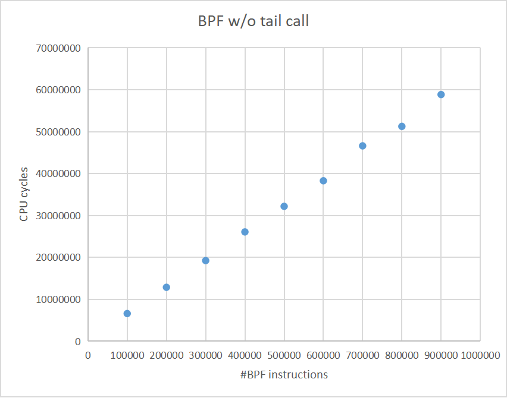

## Get started

The following instructions assume directory hierarchy of `~/inner_unikernels/` and `~/linux/`.

```shell
# First, build the kernel. Detailed steps are not elaborated here.
# ...

# Build the benchmark programs
cd ~/linux/samples/bpf/benchmark
make clean; make # Took too long? See the next section.

# Boot the VM
cd ~/linux
~/inner_unikernels/q-script/yifei-q

# Inside the guest, run the tests.
cd ~/linux/samples/bpf/benchmark/
./measure.sh
```

Example output:

```
//////////////////////////// Summary ///////////////////////////

!!!WARNING!!!
Looks one or more of the programs have failed, possibly because of
the limit of BPF program size. This script does NOT yet handle such
cases well, and please treat the following report carefully. Some
manual adjustments might be needed.

Nominal program size
====================
By "nominal", we mean we start from this value, estimate how many lines
of C code there should be, and then generate the program. The obtained
BPF assembly may have a slightly different size.
-------------------------------------------------------------------------
100000
200000
300000
400000
500000
600000
700000
800000
900000
1000000

Real program size
=================
By "real", we mean this is the actual size of obtained BPF programs,
measured through tools like `llvm-objdump' and `bpftool'.
-------------------------------------------------------------------------
100010
200010
300010
400010
500010
600010
700010
800010
900010
1000010

CPU cycles
==========
6597257
12860277
19231489
26073031
32173381
38274114
46606346
51249508
58847190
```

Plot of the results:

(Unfortunately, we don't have scripts to automate this step. You have to copy the above columns into your favorite app like `*Office`, and draw the figure in app-dependent ways.)



## What if it took too long to build the benchmark

One can also test their desired portion within the whole segment, with custom range, granularity and number of samples. This is achieved by changing `program_name.txt` and `program_size.txt` before actually building them. For example:

To draw the first 1/10 of the upper limit:

```shell
seq 1000 1000 10000 > program_size.txt
```

To include totally 20 samples:

```shell
seq 1000 1000 20000 > program_size.txt
# Always run the following after the number of samples has been changed, to sync the two files.
rm -vf program_name.txt
for i in $( seq $( cat program_size.txt | wc -l ) )
do
    printf "kern_%02d.o\n" $i >> program_name.txt
done
```

To revert to the default:

```shell
seq 100000 100000 1000000 > program_size.txt
# Always run the following after the number of samples has been changed, to sync the two files.
rm -vf program_name.txt
for i in $( seq $( cat program_size.txt | wc -l ) )
do
    printf "kern_%02d.o\n" $i >> program_name.txt
done
```

Or they can use prebuilt object files:

```shell
cd ~/linux/samples/bpf/benchmark/
make clean

wget https://github.com/whentojump/linux/releases/download/dummy/bpf_without_tail_call.tar.gz
tar zxvf bpf_without_tail_call.tar.gz
cp bpf_without_tail_call/* ~/linux/samples/bpf/benchmark/autogen
rm -r bpf_without_tail_call bpf_without_tail_call.tar.gz

# Skip compiling BPF programs and only compile the user program
mv program_name.txt program_name.txt.disable
make
# Restore the file for being used during measurement
mv program_name.txt.disable program_name.txt
```
