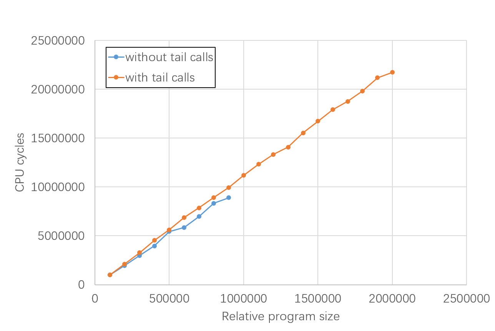

## Get started

The following instructions assume directory hierarchy of `~/inner_unikernels/` and `~/linux/`.

```shell
# First, build the kernel. Detailed steps are not elaborated here.
# ...

# Build the benchmark programs

cd ~/linux/samples/bpf/benchmark/with_tail_call/
# This script creates autogen/program_name.txt and autogen/program_size.txt.
# See the next section for instructions for customization.
./generate_prog_list.sh
# Build the user program and BPF programs.
# Took too long? See the next section.
make clean; make

# Boot the VM

cd ~/linux/
~/inner_unikernels/q-script/yifei-q

# Inside the guest, run the tests.

cd ~/linux/samples/bpf/benchmark/with_tail_call/
./measure.sh
```

Example output:

```
//////////////////////////// Summary ///////////////////////////

Number of BPF instructions per call (nominal)
=============================================
By "nominal", we mean we start from this value, estimate how many lines
of C code there should be, and then generate the program. The obtained
BPF assembly may have a slightly different size.
-------------------------------------------------------------------------
100000

Number of tail calls
====================
1
2
3
4
5
6
7
8
9
10
11
12
13
14
15
16
17
18
19
20

Real program size
=================
By "real", we mean this is the actual size of obtained BPF programs,
measured through tools like `llvm-objdump' and `bpftool'.
-------------------------------------------------------------------------
100016
200033
300050
400067
500084
600101
700118
800135
900152
1000169
1100186
1200203
1300220
1400237
1500254
1600271
1700288
1800305
1900322
2000339

CPU cycles
==========
6434634
12855267
19350063
26914191
33420843
40485625
45592212
51328694
58693333
64255254
70788572
77865488
83683126
90491380
97011499
104181253
110664174
120470599
126389125
129187423
```

Plot of the results:

(Unfortunately, we don't have scripts to automate this step. You have to copy the above columns into your favorite app like `*Office`, and draw the figure in app-dependent ways.)



If it took too long to build the BPF programs, you have two options:

1. Test with programs of smaller size
2. Use prebuilt object files

## Customize the BPF programs under test

One can test their desired portion within the whole segment, with custom range, granularity (TODO) and number of samples. This is achieved by providing extra arguments to `./generate_prog_list.sh`, which inturn will change `autogen/program_name.txt` and `autogen/program_size.txt` before actually building the programs.

Usage:

```
Specify the size of BPF programs to generate. Unit: number of tail calls.

Usage: use default size (seq 20)

       ./generate_prog_list.sh

       the script also accepts argument(s) in the same format as seq(1)

       ./generate_prog_list.sh LAST
       ./generate_prog_list.sh FIRST LAST
       ./generate_prog_list.sh FIRST INCREMENT LAST

       remove generated files

       ./generate_prog_list.sh clean
```

For example:

To draw the first 10 samples:

```shell
./generate_prog_list.sh 10
```

<!--

TODO make the workload of one single call adjustable

To include totally 20 samples:

```shell
./generate_prog_list.sh 1000 1000 20000
```

To revert to the default:

```shell
./generate_prog_list.sh 100000 100000 1000000
```

-->

## Use prebuilt object files

```shell
cd ~/linux/samples/bpf/benchmark/with_tail_call/
make clean

wget https://github.com/whentojump/linux/releases/download/dummy/bpf_with_tail_call.tar.gz
tar zxvf bpf_with_tail_call.tar.gz
cp bpf_with_tail_call/* autogen/
rm -r bpf_with_tail_call bpf_with_tail_call.tar.gz

make use_prebuilt_object_files
```
