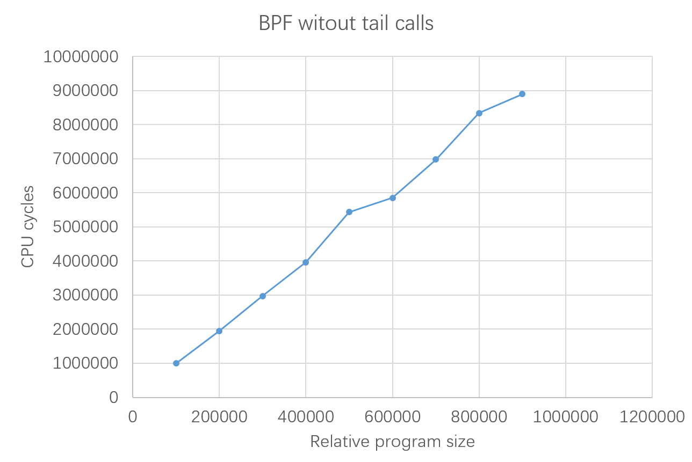

## Get started

The following instructions assume directory hierarchy of `~/inner_unikernels/` and `~/linux/`.

```shell
# First, build the kernel. Detailed steps are not elaborated here.
# ...

# Build the benchmark programs

cd ~/linux/samples/bpf/benchmark/without_tail_call/
# This script creates autogen/program_name.txt and autogen/program_size.txt.
# See the next section for instructions for customization.
./generate_prog_list.sh
# Build the user program and BPF programs.
# Took too long? See the next section.
make clean; make

# Boot the VM

cd ~/linux/
~/inner_unikernels/q-script/yifei-q

# Inside the guest, run the tests.

cd ~/linux/samples/bpf/benchmark/without_tail_call/
./measure.sh
```

Example output:

```
//////////////////////////// Summary ///////////////////////////

!!!WARNING!!!
Looks one or more of the programs have failed, possibly because of
the limit of BPF program size. This script does NOT yet handle such
cases well, and please treat the following report carefully. Some
manual adjustments might be needed.

Nominal program size
====================
By "nominal", we mean we start from this value, estimate how many lines
of C code there should be, and then generate the program. The obtained
BPF assembly may have a slightly different size.
-------------------------------------------------------------------------
100000
200000
300000
400000
500000
600000
700000
800000
900000
1000000

Real program size
=================
By "real", we mean this is the actual size of obtained BPF programs,
measured through tools like `llvm-objdump' and `bpftool'.
-------------------------------------------------------------------------
100010
200010
300010
400010
500010
600010
700010
800010
900010
1000010

CPU cycles
==========
6597257
12860277
19231489
26073031
32173381
38274114
46606346
51249508
58847190
```

Plot of the results:

(Unfortunately, we don't have scripts to automate this step. You have to copy the above columns into your favorite app like `*Office`, and draw the figure in app-dependent ways.)



If it took too long to build the BPF programs, you have two options:

1. Test with programs of smaller size
2. Use prebuilt object files

## Customize the BPF programs under test

One can test their desired portion within the whole segment, with custom range, granularity and number of samples. This is achieved by providing extra arguments to `./generate_prog_list.sh`, which inturn will change `autogen/program_name.txt` and `autogen/program_size.txt` before actually building the programs.

Usage:

```
Specify the size of BPF programs to generate. Unit: number of BPF instructions.

Usage: use default size (seq 100000 100000 1000000)

       ./generate_prog_list.sh

       the script also accepts argument(s) in the same format as seq(1)

       ./generate_prog_list.sh LAST
       ./generate_prog_list.sh FIRST LAST
       ./generate_prog_list.sh FIRST INCREMENT LAST

       remove generated files

       ./generate_prog_list.sh clean
```

For example:

To draw the first 1/10 of the upper limit:

```shell
./generate_prog_list.sh 1000 1000 10000
```

To include totally 20 samples:

```shell
./generate_prog_list.sh 1000 1000 20000
```

To revert to the default:

```shell
./generate_prog_list.sh 100000 100000 1000000
```

## Use prebuilt object files

```shell
cd ~/linux/samples/bpf/benchmark/without_tail_call/
make clean

wget https://github.com/whentojump/linux/releases/download/dummy/bpf_without_tail_call.tar.gz
tar zxvf bpf_without_tail_call.tar.gz
cp bpf_without_tail_call/* autogen/
rm -r bpf_without_tail_call bpf_without_tail_call.tar.gz

make use_prebuilt_object_files
```
